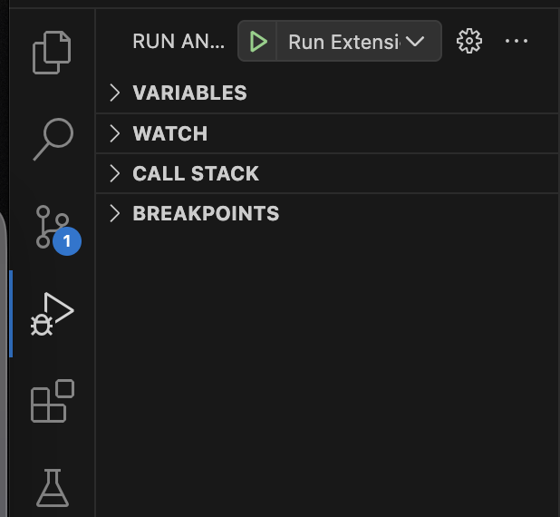

# numscript-prototype-vscode

Vscode extension for the new numscript LSP prototype

### Features

- Hover on variable to see its type
- LSP diagnostics for errors and warnings (you can see the full list [here](https://github.com/ascandone/numscript-prototype/blob/main/analysis/diagnostic_kind.go))
  - for example, invalid allotment sum, wrong type for variables, bad usage of `remaining` keyword, unbound variables, warnings for unused variables
- GOTO variable definition
- Fault tolerant parser: even when in a parsing error state, the static analysis is still able to perform checks on the rest of the AST

### Contribute or debug locally

```bash
# Install npm dependencies
yarn install # otherwise, use `npm install`
```

You'll need to install numscript CLI (for now, you can just `go install` inside [this repo](https://github.com/ascandone/numscript-prototype))

Then you can just run the extension debugger using vscode debugger (the "play" button):



### Troubleshoot

If this doesn't work, you might need to run the `npm run watch` command in a terminal tab. Vscode has a task that does it on its own when running the debugger, but in case it didn't start you can run the command on your own
